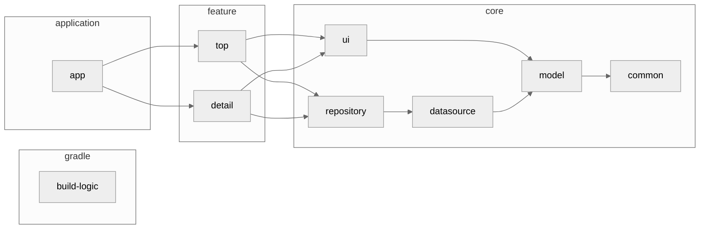

# Android研修

業務に近いかたちでアプリ開発を行いながら、
Androidアプリ開発の基礎復習・実務スキルを身に付けるための研修です.  

このAndroidプロジェクトは[android-training-template](https://github.com/yumemi-inc/android-training-template)からセットアップされました.  
課題の詳細や進め方は元のリポジトリのREADMEを参照してください.

## セットアップ

このアプリは OpenWeatherMap API を利用して天気情報を取得するため、APIキーが必要です。
[OpenWeatherMap](https://home.openweathermap.org/users/sign_up)にアカウント登録を行い、APIキーを取得してください。


取得した APIキーを `local.properties` に以下のように設定してください。
ここで設定した値が BuildConfig に反映され、`YumemiConfig` として DI 可能になります。

```
OPEN_WEATHER_MAP_API_KEY="YOUR_API_KEY"
```

## 実行

#### Android :robot:

Android Studio Koala 以上のバージョンの Android Studio で実行してください。
コマンドラインから実行する場合は Java17 がインストールされている必要があります。

#### iOS :green_apple:

Android Studio Koala 以上のバージョンの Android Studio、Xcode15 以上のバージョンの Xcode が必要です。
Android Studio から実行する場合は [Kotlin Multiplatform Plugin](https://plugins.jetbrains.com/plugin/14936-kotlin-multiplatform) をインストールの上、実行してください。

#### Wasm for Web :globe_with_meridians:

Java17 をインストールの上、以下のコマンドを実行してください。
既定のブラウザーでアプリが起動します。

```
./gradlew :app:wasmJsBrowserDevelopmentRun --continue
```

## アーキテクチャ
アプリのアーキテクチャ図です。一部現在は実装されていないモジュールが存在しますが、今後の課題で実装される予定です。


